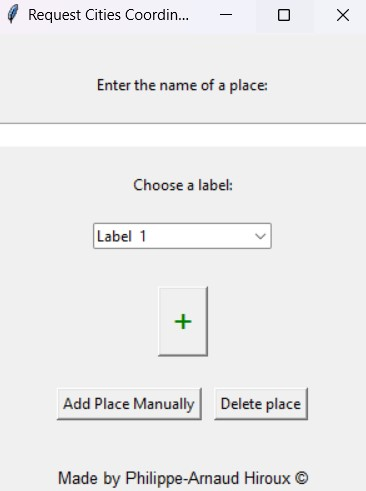
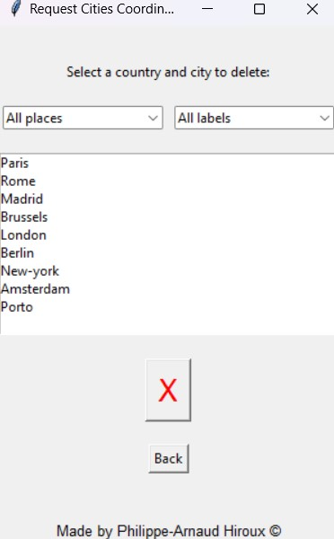
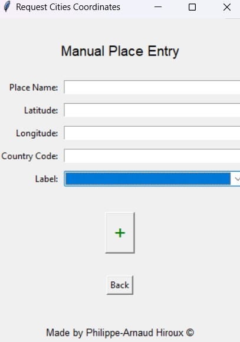
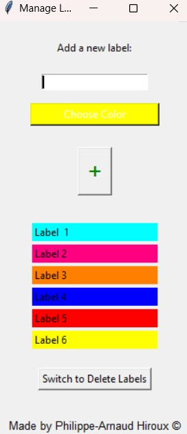
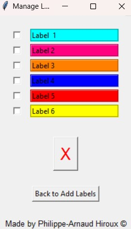
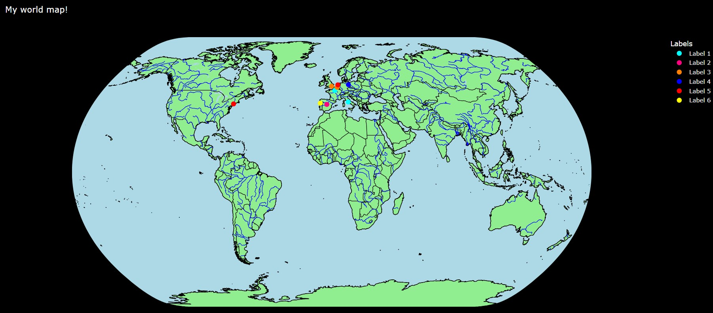
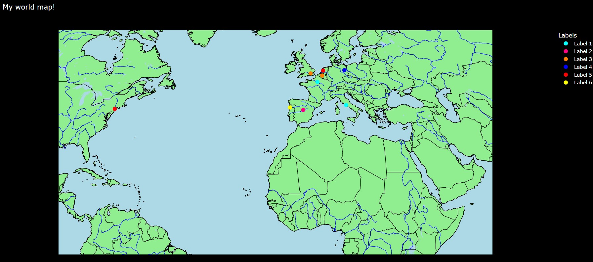

# World-map
This python project is a project where you can indicate on a world map where you have been before. You can also give each location a label.

## Libraries
```
pip install pandas
```
```
pip install plotly
```
```
pip install pycountry
```
```
pip install requests
```

## The code
When you start the code you will see the following screen. You will be given three options:
* Going to the location page
* Going to the label page
* Going to the world map


### Location frame


#### Add a location
Here you can add a location by typing the name of the location. You also need to add a label to the location. When you press the green plus symbol the longitude, latitude and country are requested from the location.
<details>
  <summary>Show add image</summary>
    
</details>

#### Delete location
On the **add location** page you have a button **Delete place**. Here you can delete a location. When you click open the page all locations from your list will appear. You can also filter by countries and by labels. When you select a location and then click on the red cross, this location will be removed from your list.
<details>
  <summary>Show delete image</summary>
    
</details>

#### Add a location manually
On the add location page there is also a button add place manually. If you click on this you can add a location manually by adding a name, longitude, latitude country code and label. When you press the green plus the location will be added to your list.
<details>
  <summary>Show add manually image</summary>
    
</details>

### Label frame


#### Add label
Here you can create a new label. First you have to give the label a name and then choose a color for your label. When you press the green plus here the label will be added to the list.
<details>
  <summary>Show add label image</summary>
    
</details>

#### Delete label
In this frame you can remove a label. You can select the box for the label, and when you press the red cross this label will be removed from the list.
<details>
  <summary>Show delete label image</summary>
    
</details>

### World map
</br>
When you press the icon above you will see a map in your browser that is run locally. On this map you will see the locations in the colors that you have assigned to them with the labels.



# Source
## Python
* [plotly.express](https://plotly.com/python/plotly-express/)
    * [Scatter plots on maps](https://plotly.com/python/scatter-plots-on-maps/)
* [tkinter](https://docs.python.org/3/library/tkinter.html)
    * [messagebox](https://docs.python.org/3/library/tkinter.messagebox.html#module-tkinter.messagebox)
    * [colorchooser](https://docs.python.org/3/library/tkinter.colorchooser.html#module-tkinter.colorchooser)
    * [ttk](https://docs.python.org/3/library/tkinter.ttk.html#module-tkinter.ttk)
* [requests](https://www.w3schools.com/python/module_requests.asp)
* [ast](https://docs.python.org/3/library/ast.html)
* [pycountry](https://pypi.org/project/pycountry/)
* [subprocess](https://docs.python.org/3/library/subprocess.html)
* [Python Image Library (PIL)](https://pillow.readthedocs.io/en/stable/)
    * [Image](https://pillow.readthedocs.io/en/stable/reference/Image.html)
    * [ImageTk](https://pillow.readthedocs.io/en/stable/reference/ImageTk.html)
* [Pandas](https://www.w3schools.com/python/pandas/default.asp)

## API
* [OpenWeathermap](https://openweathermap.org/api/geocoding-api)
