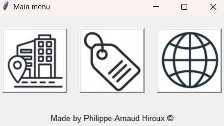

# World-map
This python project is a project where you can indicate on a world map where you have been before. You can also give each location a label.

## Libraries
```
pip install pandas
```
```
pip install plotly
```
```
pip install pycountry
```
```
pip install requests
```

## The code
When you start the code you will see the following screen. You will be given three options:
* Going to the city page
* Going to the label page
* Going to the world map


### Add frame

# Source
## Python
* [plotly.express](https://plotly.com/python/plotly-express/)
    * [Scatter plots on maps](https://plotly.com/python/scatter-plots-on-maps/)
* [tkinter](https://docs.python.org/3/library/tkinter.html)
    * [messagebox](https://docs.python.org/3/library/tkinter.messagebox.html#module-tkinter.messagebox)
    * [colorchooser](https://docs.python.org/3/library/tkinter.colorchooser.html#module-tkinter.colorchooser)
    * [ttk](https://docs.python.org/3/library/tkinter.ttk.html#module-tkinter.ttk)
* [requests](https://www.w3schools.com/python/module_requests.asp)
* [ast](https://docs.python.org/3/library/ast.html)
* [pycountry](https://pypi.org/project/pycountry/)
* [subprocess](https://docs.python.org/3/library/subprocess.html)
* [Python Image Library (PIL)](https://pillow.readthedocs.io/en/stable/)
    * [Image](https://pillow.readthedocs.io/en/stable/reference/Image.html)
    * [ImageTk](https://pillow.readthedocs.io/en/stable/reference/ImageTk.html)
* [Pandas](https://www.w3schools.com/python/pandas/default.asp)

## API
* [OpenWeathermap](https://openweathermap.org/api/geocoding-api)